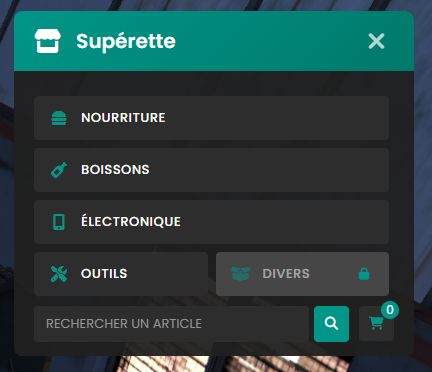
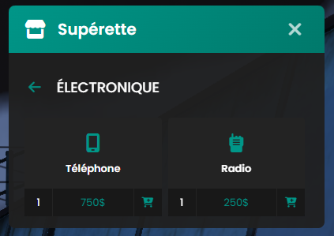
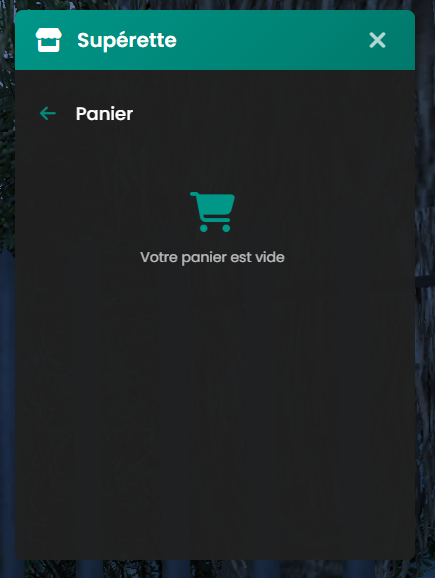
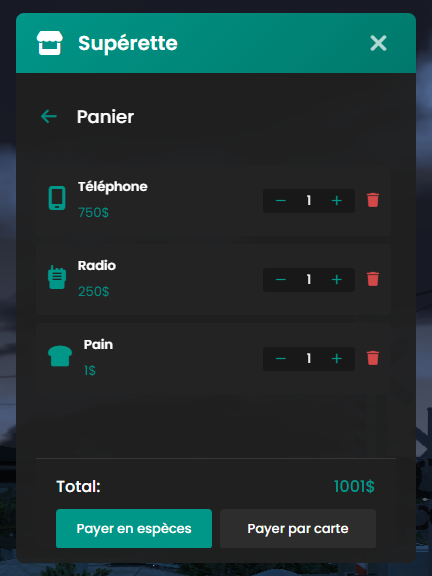
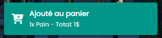
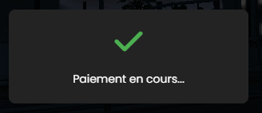

# 🏪 Système de Supérettes Optimisé pour FiveM

## 📝 Description
Un système de supérettes moderne et optimisé pour FiveM, offrant une interface utilisateur fluide et des performances exceptionnelles. Le script permet aux joueurs d'acheter divers articles dans des supérettes réparties sur la carte, avec un système de paiement en espèces ou par carte.

### ✨ Caractéristiques Principales
- Interface utilisateur moderne et responsive
- Système de catégories d'articles
- Recherche d'articles en temps réel
- Panier d'achats dynamique
- Double méthode de paiement (espèces/carte)
- Animations de paiement par TPE
- Système de notifications intégré
- Protection anti-exploit
- Optimisation maximale des performances

## 🚀 Performance
- Utilisation CPU : 0.00ms hors zone
- Utilisation CPU en zone : ~0.02ms
- Gestion optimisée des événements
- Nettoyage automatique des sessions
- Mise en cache des données fréquemment utilisées

## 📦 Installation
1. Téléchargez les fichiers
2. Placez le dossier dans votre dossier `resources`
3. Ajoutez `ensure at_shops` à votre `server.cfg`
4. Configurez le fichier `config.lua` selon vos besoins

## ⚙️ Configuration
Le fichier `config.lua` permet de personnaliser :
- Les articles disponibles et leurs prix
- Les emplacements des supérettes
- L'apparence des markers et blips
- Les distances d'interaction
- Et bien plus encore...

### Exemple de Configuration

```lua
Config.Items = {
    food = {
        {
            id = "bread",
            label = "Pain",
            price = 1,
            icon = "fa-bread-slice",
            description = "Du pain frais"
        }
    }
}
```

## 🔒 Sécurité
- Validation côté serveur de toutes les transactions
- Système de token unique par session
- Vérification de la proximité du joueur
- Protection contre les injections d'événements
- Nettoyage automatique des sessions inactives

## 🔧 Dépendances
- es_extended
- Font Awesome 6 (inclus)

## ⚡ Optimisations
- Utilisation de variables locales pour les fonctions natives
- Boucles optimisées avec compteurs numériques
- Gestion intelligente des états
- Mise en cache des données fréquentes
- Utilisation minimale des événements réseau

## 🎨 Personnalisation
- Interface entièrement personnalisable via CSS
- Système de markers configurable
- Messages et textes modifiables
- Icônes personnalisables (FontAwesome)

## 📊 Utilisation des Ressources
### Client
- Hors zone : 0.00ms
- Dans une zone : ~0.02ms
- Pendant l'utilisation : ~0.05ms

### Serveur
- Au repos : 0.00ms
- Pendant une transaction : ~0.01ms

## 🛠️ Support Technique
Pour toute question ou problème :
1. Vérifiez la configuration
2. Consultez les logs serveur
3. Assurez-vous que les dépendances sont à jour

## 📝 Notes de Version
### Version 1.0.0
- Interface utilisateur moderne
- Système de paiement dual
- Protection anti-exploit
- Optimisations de performance
- Documentation complète

## 📜 Licence
Ce script est protégé par licence. Voir le fichier `LICENSE` pour plus de détails.

## ⚠️ Points Importants
1. Assurez-vous que les IDs des items correspondent à votre système d'inventaire
2. Vérifiez les coordonnées des supérettes avant le déploiement
3. Testez les transactions avant la mise en production
4. Surveillez les logs pour détecter d'éventuelles tentatives d'exploitation

## 🔄 Mises à Jour Futures
- Système de promotions
- Interface admin
- Statistiques de vente
- Système de stock
- Support multi-langues

## Image





